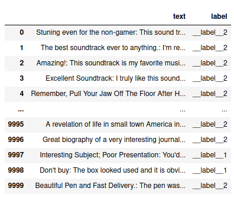
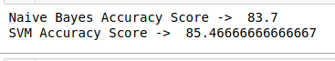

# Topic_Classification_SVM_NV
By using the Amazon Review Data set which has 10,000 rows of Text data which is classified into “Label 1” and “Label 2”.The Data set has two columns “Text” and “Label”.
Two algorithms were used and SVM showed better result than Naive Bayes.
# Dataset 
For Dataset, We take Amazon Review Data

# Result

